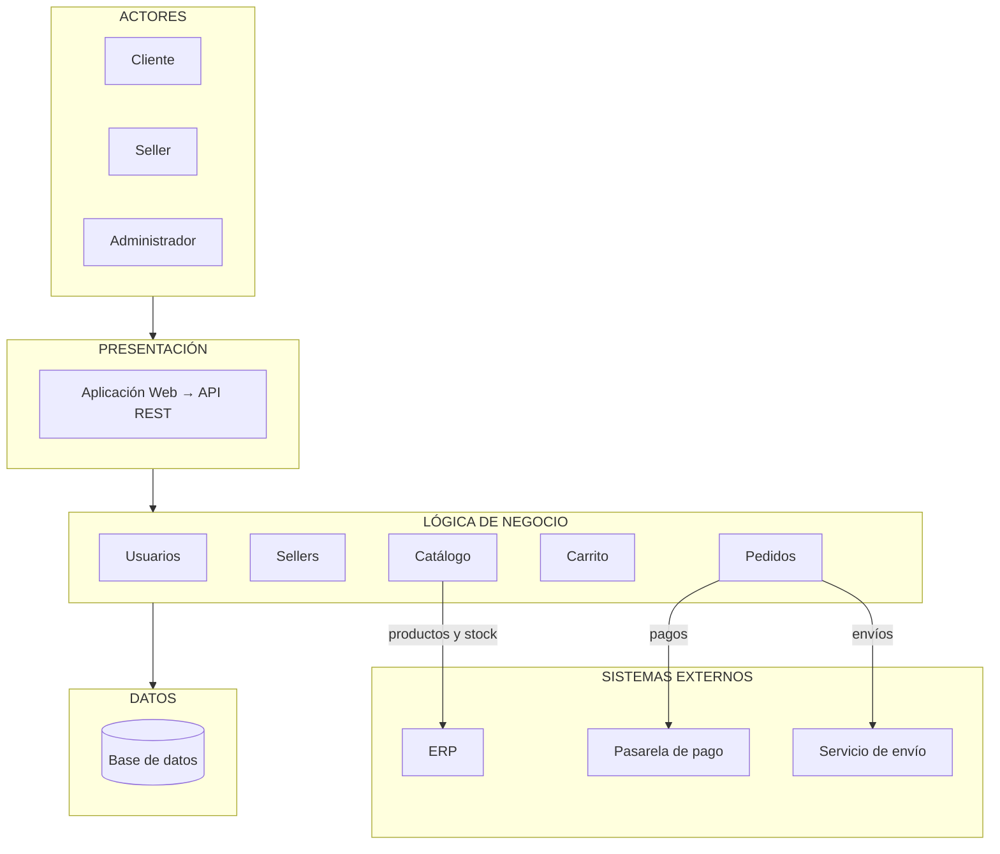

# Arquitectura inicial del sistema

## Arquitectura en tres capas

| Capa | Pregunta que responde |
|---|---|
| Presentación | ¿Cómo interactúa el usuario? |
| Lógica de negocio | ¿Qué hace el sistema? |
| Datos | ¿Dónde se almacena la información? |

## Diagrama de arquitectura

## Descripción

La arquitectura inicial se organiza en tres capas principales:

- **Presentación:** permite la interacción de los usuarios con el sistema mediante la aplicación web y la API REST.
- **Lógica de negocio:** contiene los principales módulos responsables de las funcionalidades del sistema: usuarios, sellers, catálogo, carrito y pedidos.
- **Datos:** permite almacenar y consultar la información mediante una base de datos.

Cada capa tiene sus propias responsabilidades y se comunica solo con la capa inmediatamente inferior.

Además, el módulo de **Pedidos** se integra con sistemas externos como la **pasarela de pago** y el **servicio de envío**, y el módulo de **Catálogo** se integra con el **ERP** para obtener información de productos y stock.

## Relación con los drivers arquitectónicos

- **DA01 y DA02 (escalabilidad y rendimiento):** la separación en capas permite escalar la lógica de negocio de forma independiente.
- **DA03 (seguridad):** la autenticación y autorización se gestionan en el módulo Usuarios.
- **DA04 (pasarela de pago):** la integración de pagos está aislada en el módulo Pedidos.
- **DA05 (API REST):** la presentación se comunica con la lógica de negocio mediante una API REST.