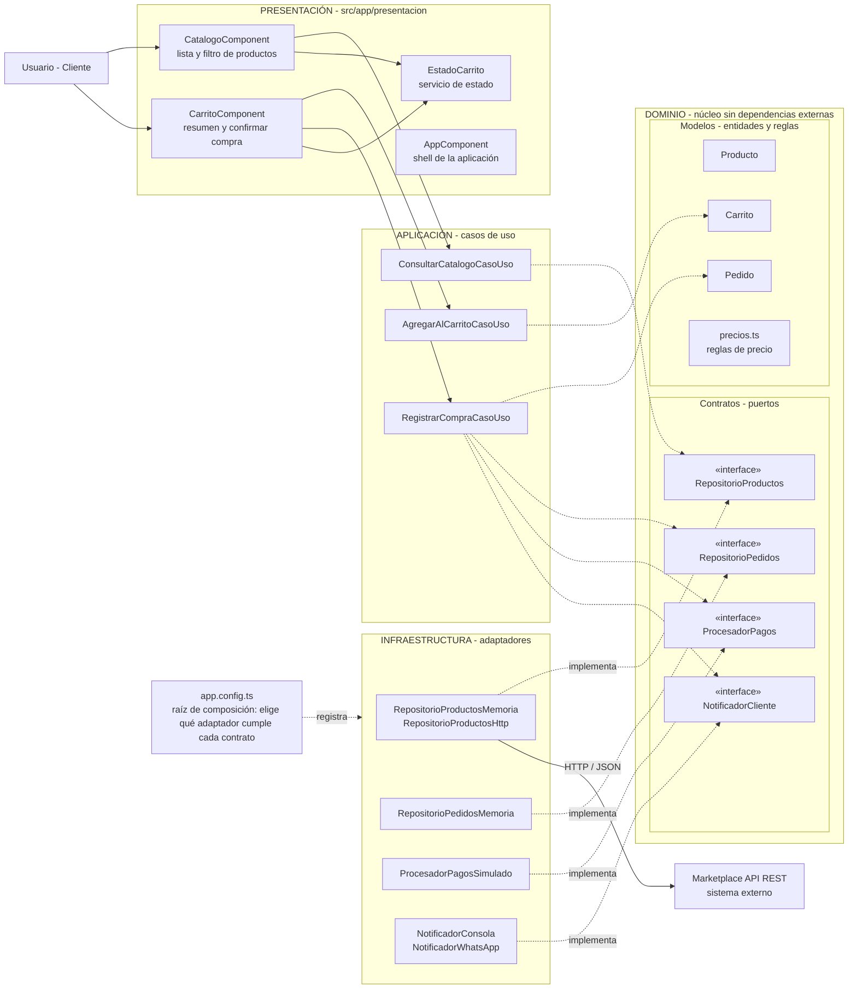

# Enfoque arquitectónico: Clean Architecture

| Elemento | Descripción aplicada al Marketplace |
|---|---|
| Patrón / enfoque arquitectónico | Clean Architecture (Arquitectura Limpia). |
| Objetivo | Separar responsabilidades y controlar las dependencias hacia el dominio. |
| ¿Qué problema resuelve? | Evita el acoplamiento entre la interfaz Angular, las reglas del negocio y las tecnologías externas, como bases de datos, API y servicios de pago. |
| Capas definidas | Presentación, Aplicación, Dominio e Infraestructura. |
| Beneficios | Facilita el mantenimiento y las pruebas unitarias. Permite cambiar implementaciones técnicas sin modificar innecesariamente las reglas del negocio. Mejora la organización y separación de responsabilidades del código. |
| Driver que responde | DA06 - Mantenibilidad (y DA04 - Integración con pagos). |

## Regla de dependencia
Las dependencias del código **siempre apuntan hacia el dominio**:

1. El dominio no importa nada de las capas externas (ni Angular, ni HttpClient, ni RxJS).
2. Los casos de uso solo conocen entidades y contratos (interfaces).
3. Los adaptadores de infraestructura implementan los contratos; son intercambiables.
4. Cambiar de tecnología significa cambiar `app.config.ts`, no el dominio.

## Diagrama del enfoque

**Leyenda:**
- Flecha continua: llamada en tiempo de ejecución.
- Flecha punteada: dependencia de código (`import`), siempre hacia el centro.
- "implementa": el adaptador cumple el contrato definido en el dominio (inversión de dependencias).

## Diferencia con el estilo arquitectónico

| | Estilo (estilo-arquitectonico.md) | Enfoque (este archivo) |
|---|---|---|
| Responde | ¿Cómo es el sistema globalmente? | ¿Cómo se organiza por dentro? |
| Decisión | Monolito modular en capas | Clean Architecture |
| Dependencias | De arriba hacia abajo | Hacia el dominio (invertidas) |