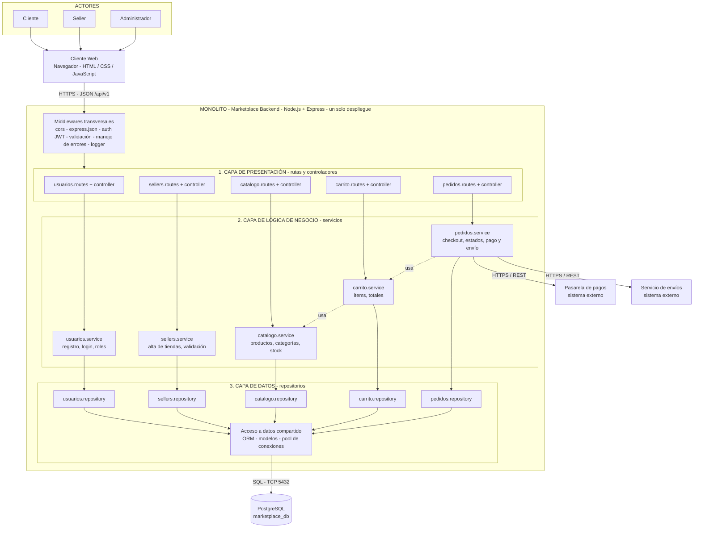

# Estilo arquitectónico

## Estilo seleccionado
**Monolito modular organizado en capas.**

- **Monolito:** todo el backend es una sola aplicación (Node.js + Express), que se ejecuta en un único proceso y tiene un solo despliegue.
- **Modular:** por dentro se divide en módulos independientes: Usuarios, Sellers, Catálogo, Carrito y Pedidos.
- **En capas:** cada módulo se organiza en tres capas: Presentación, Lógica de negocio y Datos.

El monolito es la **unidad de despliegue** y las capas son la **organización lógica**. Ambos coexisten.

## Justificación

| Driver | Cómo lo responde el estilo |
|---|---|
| DA01 - Escalabilidad | La aplicación puede replicarse horizontalmente detrás de un balanceador. |
| DA05 - API REST | El cliente web se comunica con el backend mediante una API REST (HTTPS/JSON). |
| DA06 - Mantenibilidad | Los módulos separan responsabilidades; un cambio en un módulo no afecta a los demás. |

**Alternativa descartada:** microservicios. Para el tamaño actual del marketplace añaden complejidad de despliegue, comunicación y datos sin un beneficio claro.

## Diagrama del estilo arquitectónico

## Reglas de la arquitectura

1. Cada capa solo invoca a la capa inmediatamente inferior.
2. Un módulo no accede al repositorio ni a las tablas de otro módulo.
3. La comunicación entre módulos se hace llamando a su servicio (flechas punteadas).
4. Todo se ejecuta en un único proceso Node.js con una única base de datos.